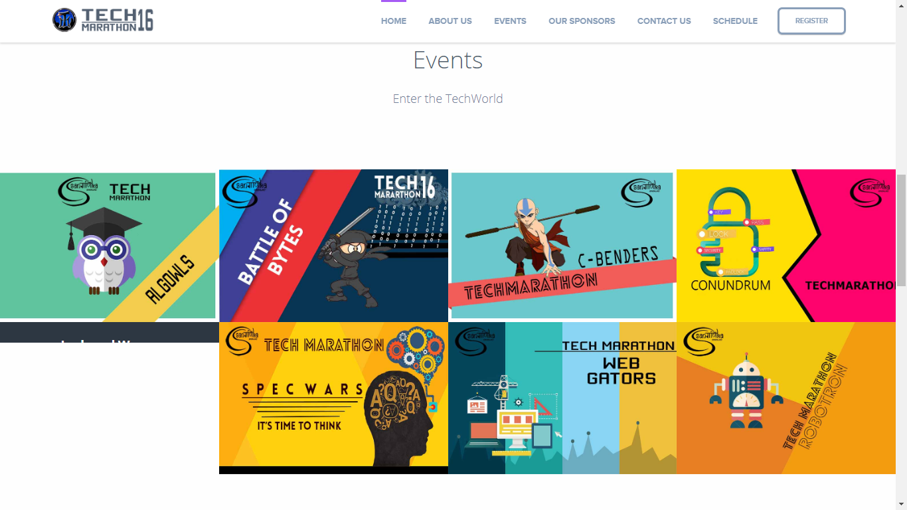
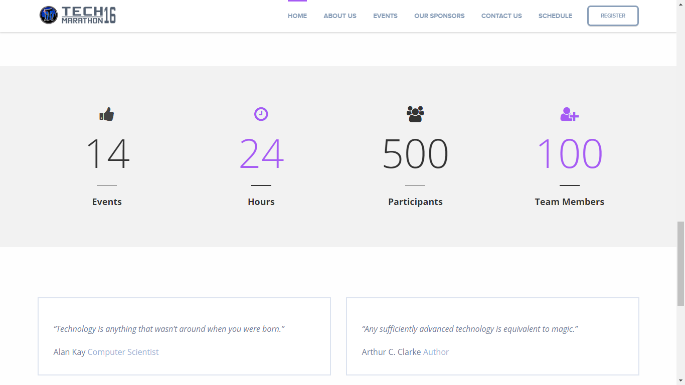
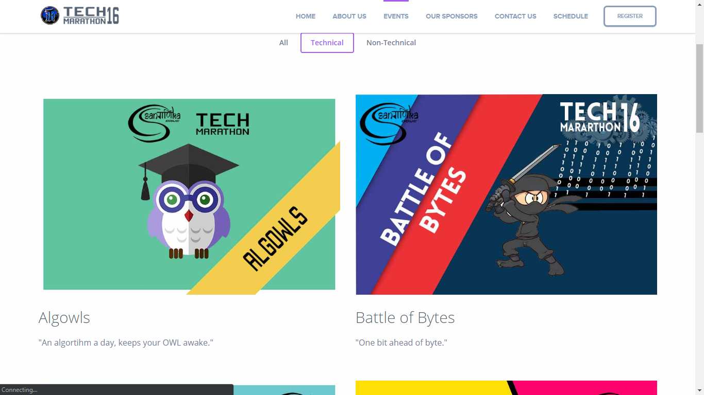
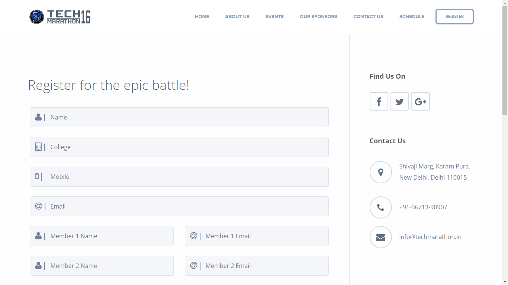

# Techmarathon 2016 Website

Source code for Techmarathon 2016 - Annual technical fest of DDUC, University of Delhi

## Dev

- This code here is kept for archival purposes. It is not fit for use.
- This was an intermediate code, so it may have bugs.
- If you still want to use it
  - figure out the database structure (no dump available)
  - create a database on server
  - change database credentials in `connect.php`
  - then server using `php -S localhost:3000`
  - Alternatively, you can use `xampp` to manage everything

## Screenshots

